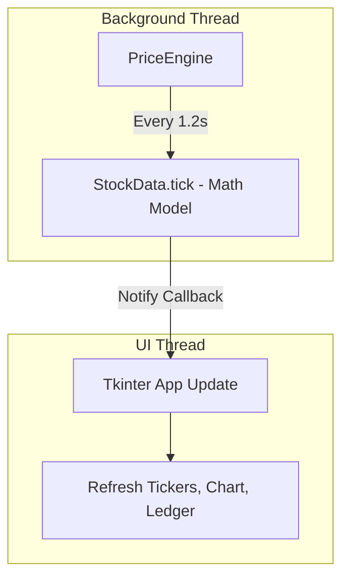

<div align="center">

# 📈 MarketPulse: Indian Market Dashboard


> A blazingly fast, multi-threaded, real-time simulated stock market trading dashboard.
> Built with purely Python, Tkinter, and Matplotlib. Inspired by the sleek, dark UI of modern apps like Groww.
> Designed for learning, trading demos, and college projects.
>
> **[Features](#-features)** • **[Installation](#-installation)** • **[Architecture](#-architecture)** • **[Future Improvements](#-future-improvements)** 

<p align="center">
 
  
</p>

</div>

---

## ✨ Features

- **🚀 Live Simulation Engine:** Real-time fractional price ticks built on the *Geometric Brownian Motion* algorithm, creating incredibly realistic market behaviors. Updates every ~1.2s.
- **🕯️ Live Candlestick Charts:** High-performance Tkinter Canvas embedded with Matplotlib for drawing beautiful bullish (green) and bearish (red) real-time candlesticks.
- **🌊 Immersive Momentum Panel:** An interactive tick-level price line featuring a gorgeous gradient filling right below the curve.
- **💼 Advanced Order Execution:** Seamless buy/sell order placement with intuitive user controls and immediate portfolio feedback.
- **🏦 Comprehensive Portfolio Manager:** Track your net worth, invested capital, open positions, unrealized P&L, and transaction history.
- **🌙 Deep Dark Aesthetic:** Gorgeous `#0f0f11` base background and vibrant, high-contrast neon accents (teal/red).
- **🧵 Responsive Threading:** Ultra-smooth experience. Heavy mathematical simulations execute independently to ensure zero GUI-lag.

---

## 🏃‍♀️ How to Run the App (Installation)

Follow these simple steps to install and run the project locally. 

### Prerequisites

Ensure you have Python 3.9+ installed on your system. 

### Step 1: Clone the Repository
```bash
git clone https://github.com/Karanpatil1201/MarketPulse.git
cd MarketPulse
```

### Step 2: Install Dependencies
Install the required packages using the generated requirements file.
*(It relies mostly on standard libraries and `matplotlib`)*
```bash
pip install -r requirements.txt
```
> 💡 **Pro-Tip for Linux Users**: `tkinter` may not come pre-installed. Run `sudo apt install python3-tk` before proceeding.


### Step 3: Launch the Dashboard! 🚀
Run the simulation by starting the entrypoint file:
```bash
python main.py
```

---

## 🛠️ Project Architecture

We believe in clean code and separation of concerns.

```text
├── main.py              ← The blazing fast entry point (only 5 lines!)
├── config.py            ← All constants: tickers, aesthetic tokens, UI colors, fonts
├── engine.py            ← Heavy lifting: Price simulation (GBM), StockData, PriceEngine
├── portfolio.py         ← Order logic, Position Management, P&L generation, TX history
├── ui.py                ← Tkinter GUI Views, Canvas Widgets, Component Factories
├── requirements.txt     ← Dependencies
└── .gitignore           ← Excluded files
```

### Multithreaded Data Flow



---

## 🧮 The Mathematics: Geometric Brownian Motion

To deliver real-time stock ticks, we use the standard financial engineering formula for stock-movements:

```python
price(t+1) = price(t) × exp( drift + volatility × N(0,1) )
```

| Parameter    | Example (RELIANCE) | Meaning |
|---|---|---|
| `drift`      | `0.0002`           | Upward/Downward bias |
| `volatility` | `0.0035`           | Magnitude of market shock |

*Fine-tune these parameters for any stock right inside `config.py`.*

---

## 🎨 UI Color Palette

Clean and highly energetic design system.

| Color Preview | Role | Hex Value |
|:---:|---|:---:|
| 🟤 | Background | `#0f0f11` |
| 🔘 | Cards / Panels | `#1a1a1f` |
| 🟢 | Accent Green (Buy/Profit) | `#00d09c` |
| 🔴 | Accent Red (Sell/Loss) | `#f0616d` |
| 🔵 | Accent Blue (Active UI) | `#4d8af0` |
| ⚪ | Text Primary | `#f4f4f5` |
| 🩶 | Text Secondary | `#8b8b9e` |

---

## 🔮 Future Improvements Roadmap

We are constantly improving the system. We welcome PRs!

- [ ] Persistent portfolio save/load (JSON / SQLite support)
- [ ] Deep technical indicators (RSI, MACD overlays)
- [ ] Multi-timeframe charts (1m, 5m, 1h, Daily views)
- [ ] Bid/Ask spread modeling (Order book simulator)
- [ ] Trade Alert System

---

## 👨‍💻 Developed By

**Karan Patil** — B.Tech ECE, Walchand Institute of Technology, Solapur  
[](https://github.com/Karanpatil1201)
[](https://linkedin.com/in/karan-patil-253163357/)

> ⚠️ **Disclaimer:** *Built strictly for educational purposes. Prices are simulated through stochastic differential equations and do not represent actual market values.*
